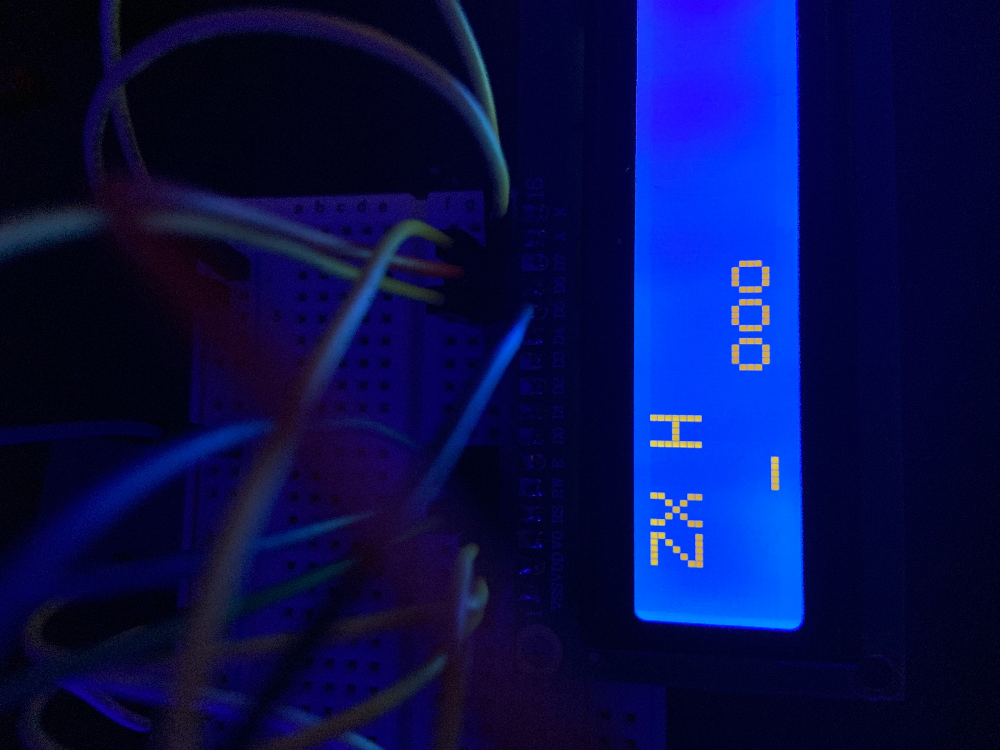

# HD44780 Library for STM32
This is a lightweight library for interacting with the HD44780 character LCD (16x2).

I made this library for a few reasons.
1. Some of the existing libraries for this LCD were using HAL. I didn't feel like using it
2. In general I wanted to learn how to interact with an LCD myself as I've never done it before

# Supported Boards
This code in particular is written for the STM32F411 (Black Pill). But the code can be easily tweaked for your specific board, all you need to do is update any differences between registers (e.g. where the GPIO clocks are and such).

This also includes the device header (not included in repo) so if you are using a different board than the STM32F411 be sure to include your specific device header.

# How to Include in Your Project
1. Generate a blank project for your board from STM32CubeMX
2. (optional) Create a folder called `hd44780` or whatever you like in both the `Core/Src` and `Core/Inc` directories
3. Add the `src` and `include` files into the appropriate folders
4. Update include paths & sources in the build tool (e.g. Makefile)

Afterwards it should compile and work!

# API
See the [commands header](./include/commands/commands.h) for the full API (only write operations are supported in this library for now).

# Warnings
I have not tested 8-bit mode but have written the code for it. It may or may not work.

4-bit mode is what I have personally used and tested.

# Example
Here's an example using some of the supported API functions.

```c
// use your device header (be sure to update the registers if you are NOT using STM32F411)
#include "stm32f411xe.h"
#include "hd44780.h"

int main()
{
    
    // I have my D7 - D4 pins connected to PB9 - PB6
    GPIO_TypeDef* data_ports[4] = {GPIOB, GPIOB, GPIOB, GPIOB};
    uint8_t data_pins[4] = {9, 8, 7, 6};

    lcd _lcd;
    // my RS pin = PB4
    // my RW pin = PB3 (unused for now)
    // my E pin = PB5
    // FOUR = 4-bit mode, EIGHT = 8-bit mode
    lcd_init(&_lcd, data_ports, data_pins, GPIOB, 4, GPIOB, 3, GPIOB, 5, FOUR);
    
    lcd_enable_cursor(&_lcd); // turn on blinking cursor (off by default)

    lcd_write_string(&_lcd, "ZACH");
    lcd_clear_char(&_lcd, 0, 2); // clear character at position (0, 2)
    lcd_backspace(&_lcd);
    lcd_write_char(&_lcd, 'X');
    lcd_set_cursor(&_lcd, 1, 3); // set cursor at position (1, 3)
    lcd_write_string(&_lcd, "yoooo");
    lcd_clear_section(&_lcd, 1, 2, 4); // clear index 2-4 on row 1


    while(1) {}
    return 0;
}
```

After compiling and running I get the following:

